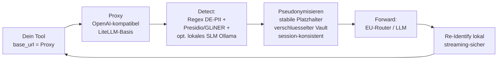

# Konzept: Datenschleuse

> Offener, selbst-hostbarer PII-Anonymisierungs-Proxy für LLM-Anfragen, mit erstklassiger deutscher Datenerkennung und ehrlicher DSGVO-Story. Made for the DACH-KI-Community.

**Status:** Konzeptphase | **Erstellt:** 2026-06-29 | **Owner:** Oliver | **Strategische Einordnung:** Open-Source-Community-Asset (Reichweite & Autorität zuerst, Umsatz folgt)

---

## 1. Elevator Pitch

Ein Dienst, den du zwischen dein Tool und jedes KI-Modell hängst. Du biegst nur die `base_url` auf den Proxy um, sonst ändert sich nichts. Der Proxy erkennt personenbezogene Daten lokal, ersetzt sie durch stabile Platzhalter, schickt nur den anonymisierten Text an die Cloud (bzw. an deinen EU-Router), und setzt in der Antwort die echten Werte lokal wieder ein. Personenbezogene Daten verlassen dein System nie im Klartext.

## 2. Das Problem

Selbst mit einem EU-Router gehen Klartext-Personendaten an einen Modellanbieter. Das ist datenschutzrechtlich heikel (CLOUD Act bei US-Anbietern unabhängig vom Serverstandort) und für viele Zielgruppen (Kanzleien, Praxen, Mittelstand) ein hartes Adoptions-Hindernis. Eine zusätzliche Schicht, die PII gar nicht erst rausgehen lässt, schließt diese Lücke.

## 3. Marktlage (ehrlicher Stand 2026-06-29)

Der DACH-Markt ist **nicht leer**. Direkte Wettbewerber, die das Pattern fahren:

| Anbieter | Form | Anmerkung |
|----------|------|-----------|
| KI-Shield (Greußen) | kommerziell, closed | Transparenter Proxy, <50ms, "Made in Germany" |
| ITWorxx | Consulting + Custom-Deploy | Regex-first + lokales LLM-Residual + Redis-Vault, fast identische Architektur |
| innoGPT | kommerzielles Produkt | DE-Server + NER |
| Pexon Consulting | Consulting | Presidio + Audit-Trails |
| TwinDash | kommerziell | KI-Agent-Proxy für Website-Chats |
| International | Enterprise | Private AI, Skyflow LLM Vault, Nightfall, Protecto (intransparente 5-6-stellige Verträge) |

**Die echte Lücke:** Es gibt keine dominante, offene, community-getriebene Lösung mit Self-Hosting und richtig guter Developer Experience. Kein "WireGuard der KI-Privacy". Genau das besetzen wir.

## 4. Positionierung & USP

1. **Open Source & selbst-hostbar** statt closed/Consulting. `docker compose up` und es läuft.
2. **Erstklassige deutsche Recognizer.** Belegter Hebel: Presidio erkennt deutsche Steuer-ID, IBAN, BIC, Handelsregisternummer out-of-the-box zu 0%. Wer die besten DE-Recognizer hat, gewinnt.
3. **Ehrliche DSGVO-Story.** Wir sagen klar, dass Pseudonymisierung das Risiko stark senkt, die Daten aber NICHT aus dem DSGVO-Scope nimmt. Kein Compliance-Marketing-Bullshit. Das schafft Vertrauen, das die Closed-Player nicht haben.
4. **Beste DX.** Drop-in base_url, klare Configs, gutes Audit-Log, transparent nachvollziehbar was rausging.

## 5. Name (festgelegt 2026-06-29)

**Datenschleuse.** Daten gehen kontrolliert durch eine Schleuse, klingt deutsch und seriös, einprägsam als Marke. Domain/GitHub-Verfügbarkeit vor Launch prüfen.

## 6. Architektur

**Kernprinzipien:**
- Fail-closed by default (lieber blocken als PII durchlassen)
- Session-konsistente Pseudonyme (gleiche Person, gleicher Token, damit das Modell sinnvoll arbeitet)
- Mapping bleibt lokal, verschlüsselt, mit TTL
- Streaming-sicheres Re-Identification (Platzhalter dürfen nicht über SSE-Chunks zerfallen, daran scheitern die meisten, das ist unser Qualitäts-Hebel)
- Kein PII in Logs

## 7. Tech-Stack-Entscheidung

Bewusste Ausnahme von der bun/TypeScript-Regel: **Basis ist Python (LiteLLM + Presidio).** Begründung: Beide sind die De-facto-Standards, battle-tested, OpenAI-kompatibel, mit deutscher Sprachunterstützung in Presidio. Bei Null in TypeScript zu bauen würde Monate kosten und kaum Mehrwert bringen. Unser Eigenanteil (deutsche Recognizer, Re-Identification, Packaging, DX) ist genau das, was den Unterschied macht. Falls später ein schlanker TS-Proxy-Layer sinnvoll wird (Streaming-Kontrolle), kann der vorgeschaltet werden.

## 8. MVP-Scope (v0.1)

- [ ] OpenAI-kompatibler Endpoint (`/v1/chat/completions`), base_url-Drop-in via LiteLLM
- [ ] Presidio-Guardrail aktiviert (Input + Output)
- [ ] Deutsche Custom-Recognizer: IBAN, BIC, Steuer-ID, Sozialversicherungsnummer, Handelsregisternummer, KFZ-Kennzeichen, deutsche Telefon/PLZ/Adresse
- [ ] Namen/Orte/Orgs via GLiNER oder Presidio-NER (deutsch)
- [ ] Session-konsistente Pseudonymisierung + lokales verschlüsseltes Mapping
- [ ] Re-Identification der Antwort (non-streaming)
- [ ] Fail-closed
- [ ] Docker-Compose + One-Liner-Install (Stil des Coolify-Hardening-Repos)
- [ ] README mit ehrlicher DSGVO-Einordnung

## 9. Roadmap

- **v0.1** MVP wie oben, lokal lauffähig, ein sauberer Testfall gegen den EU-Router
- **v0.2** Streaming-sicheres Re-Identification, Audit-Log-UI, Confidence-Thresholds, Block-Modus für hochsensible Kategorien
- **v0.3** Benchmark-Suite (deutsche PII-Erkennungsrate vs. Presidio-Default, als Beweis und Marketing), mehr DE-Recognizer
- **v1.0** Stabile Releases, Doku, Community-Beiträge, Multi-Provider getestet (Anthropic/OpenAI/Mistral/OpenRouter)

## 10. DSGVO-Einordnung (Pflicht-Kommunikation)

Pseudonymisierung reduziert das Risiko erheblich, nimmt die Daten aber rechtlich NICHT aus dem DSGVO-Scope. Der Proxy ist kein Compliance-Zertifikat und kein Ersatz für eine Datenschutz-Folgenabschätzung. Diese Ehrlichkeit ist bewusst Teil der Markenidentität.

## 11. Monetarisierungs-Pfad (langfristig)

Open-Source-first heißt nicht umsonst. Reichweite und Autorität zahlen später ein über:
- **Managed Hosting** (gehosteter Proxy für die, die nicht selbst hosten wollen)
- **Premium-Recognizer-Packs** (branchenspezifisch: Medizin, Recht, Versicherung)
- **Support & Setup** (Beratung, Custom-Deploy, im Stil von ITWorxx, aber auf offener Basis)
- **Bootcamp-Modul** (KIMIBOCA: "Sichere KI im Unternehmen einrichten")

## 12. Risiken

- Markt schon besetzt durch etablierte Closed-Player mit Vorsprung
- Open Source schwer direkt monetisierbar (deshalb: Asset-Logik, nicht Produkt-Logik zuerst)
- PII-Erkennung ist nie 100%, False Negatives sind ein Reputationsrisiko (deshalb fail-closed + ehrliche Kommunikation)
- Wartungsaufwand für deutsche Recognizer

## 13. Community-Go-to-Market

- GitHub-Repo mit One-Liner-Install, sauberes README, Benchmark als Beweis
- AIIANER-Video: "Wie du verhinderst, dass deine Kundendaten bei OpenAI landen"
- Skool/KIMIBOCA: Setup-Anleitung als Community-Content
- Positionierung: Oliver als der, der KI-Datenschutz für DACH praktisch löst
