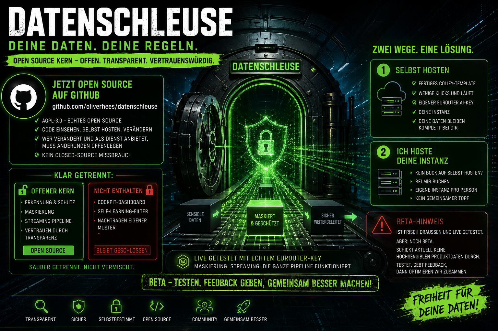

<div align="center">

**🚧 STATUS: BETA v1.1**



# 🔒 AIIANER-DATENSCHLEUSE

**Der offene, selbst-hostbare PII-Anonymisierungs-Proxy für LLM-Anfragen.**

[](LICENSE)
[](#-status)
[](#-architektur)
[](#-was-erkannt-wird)

*Hänge sie zwischen dein Tool und die KI. Personenbezogene Daten verlassen dein System nie im Klartext.*

[Quickstart](#-quickstart) · [Architektur](#-architektur) · [Sicherheitsmodell](#-sicherheitsmodell) · [Coolify-Deploy](DEPLOY.md) · [Wiki](../../wiki) · [Lizenz](#-lizenz)

</div>

---

## Inhaltsverzeichnis

- [Warum die Datenschleuse](#warum-die-datenschleuse)
- [Was uns unterscheidet](#-was-uns-unterscheidet)
- [Features](#-features)
- [Quickstart](#-quickstart)
- [Architektur](#-architektur)
- [Sicherheitsmodell](#-sicherheitsmodell)
  - [Fail-Policy](#fail-policy-verfügbarkeit-vs-datenschutz)
  - [Schutzklassen-Modell](#schutzklassen-modell-drei-sensitivitätsstufen)
  - [Quasi-Identifier](#quasi-identifier-session-übergreifende-akkumulation)
- [Was erkannt wird](#-was-erkannt-wird)
- [Ehrliche DSGVO-Einordnung](#️-ehrliche-dsgvo-einordnung-bitte-lesen)
- [Lizenz](#-lizenz)
- [Status](#-status)
- [Kein Bock auf Selbst-Hosten?](#-kein-bock-auf-selbst-hosten)
- [Mitmachen](#-mitmachen)

---

## Warum die Datenschleuse

Sobald du mit einer Cloud-KI arbeitest (egal ob über [Hermes](https://github.com/NousResearch/hermes-agent), ChatGPT-kompatible Clients oder eigene Tools), gehen deine Prompts an fremde Server. Kundenname hier, Rechnungsnummer da, vielleicht die Steuer-ID aus Versehen mit reinkopiert — macht fast jeder, macht sich aber kaum einer Gedanken drüber.

Die Datenschleuse ist ein **OpenAI-kompatibler Proxy**, der personenbezogene Daten lokal erkennt, durch Platzhalter ersetzt, nur den anonymisierten Text an das KI-Modell schickt und die echten Werte in der Antwort wieder einsetzt. Du biegst nur die `base_url` deines Tools auf die Datenschleuse um — sonst ändert sich nichts an deinem Workflow.

Der Unterschied zu den meisten Lösungen am Markt: Closed-Source-Enterprise-Tools mit Preisen auf Anfrage, oder Erkennung nur auf Einzelwort-Ebene ("Rechnungsnummer 12345" ja, aber "42, männlich, Ingenieur in Weimar" als re-identifizierende Kombination nein). Die Datenschleuse ist offen, selbst hostbar, und geht mit dem [Quasi-Identifier-Feature](#quasi-identifier-session-übergreifende-akkumulation) über Einzelwort-Erkennung hinaus.

## 🏆 Was uns unterscheidet

Es gibt zwei Arten von Alternativen: fertige Closed-Source-Enterprise-Tools (Preise auf Anfrage, Blackbox) und DIY-Setups, die sich selbst aus LiteLLM + Presidio zusammenbauen (die Basis, auf der auch wir aufsetzen). Gegen beide unterscheiden wir uns konkret:

| | Closed-Source-Enterprise-Tools | DIY LiteLLM+Presidio | Datenschleuse |
|---|---|---|---|
| **Code einsehbar** | ❌ Blackbox | ✅ | ✅ AGPL-3.0 |
| **Preis** | Auf Anfrage, meist vierstellig+ | Kostenlos, aber Marke Eigenbau | Kostenlos (selbst hosten) oder gebuchte Instanz |
| **Erkennung über Einzelwörter hinaus** | Unterschiedlich, meist Blackbox | ❌ Presidio erkennt Einzelentitäten, keine Kombinationen | ✅ [Quasi-Identifier-Layer](#quasi-identifier-session-übergreifende-akkumulation): PLZ+Geburtsjahr+Geschlecht+Beruf werden session-übergreifend erkannt und generalisiert |
| **Streaming ohne Wartezeit** | Unterschiedlich | ❌ LiteLLMs Standard-Guardrail buffert die komplette Antwort, bevor re-identifiziert wird — Streaming fühlt sich an wie non-Streaming | ✅ Eigener Sliding-Window-Guardrail, echtes Token-Streaming bleibt erhalten |
| **Deutsche Entitäten** | Unterschiedlich | ❌ Presidio erkennt out of the box kaum deutsche Formate | ✅ Eigene Recognizer für Steuer-ID, Sozialversicherungsnummer, Handelsregisternummer, KFZ-Kennzeichen |
| **Abgestufter Umgang mit besonders sensiblen Daten** | Unterschiedlich | ❌ Alles läuft gleich durch die Pipeline | ✅ [Schutzklassen-Modell](#schutzklassen-modell-drei-sensitivitätsstufen): Art. 9/10 DSGVO-Daten (Gesundheit, Religion, sexuelle Orientierung, Gewerkschaft, Vorstrafen) werden hart blockiert, keine Config-Umgehung möglich |
| **Fail-Verhalten bei Fehlern** | Unterschiedlich | Meist nicht spezifiziert | ✅ Fail-closed by Design: Maskierungsfehler blockieren die Anfrage, nie unmaskiert durchlassen |

Ehrlich gesagt: Die Basis-Idee (LiteLLM + Presidio) ist nicht unsere Erfindung, das macht im DACH-Raum niemand allein. Unser Mehrwert liegt in dem, was fehlt, wenn man das nur aus der Doku zusammenbaut: streaming-sichere Re-Identifikation, deutsche Recognizer, Quasi-Identifier-Erkennung und das Schutzklassen-Modell — alles live gegen echte Anfragen getestet, nicht nur in der Theorie.

## ✨ Features

- **OpenAI-kompatibler Drop-in-Proxy** — nur `base_url` umbiegen, kein Umbau am eigenen Tool nötig.
- **Deutsche Custom-Recognizer** — Steuer-ID, Sozialversicherungsnummer, Handelsregisternummer, KFZ-Kennzeichen. Genau das, was Standard-Presidio nicht erkennt.
- **Streaming-sichere Re-Identification** — eigener Sliding-Window-Guardrail statt LiteLLMs Full-Buffer-Ansatz, erhält echtes Token-Streaming.
- **Quasi-Identifier-Erkennung** — Session-übergreifende Akkumulation, generalisiert statt löscht (PLZ→Region, Jahr→Dekade, …).
- **Schutzklassen-Modell** — 3-Stufen-Sensitivitätsklassifizierung, Stufe 3 (Art. 9/10 DSGVO) ist eine harte Code-Garantie, nie konfigurierbar.
- **Mehrere Modelle wählbar** — mehrere `model_list`-Einträge, automatische Erkennung durch OpenAI-kompatible Clients (inkl. Hermes' Modell-Picker).
- **Eingebautes Admin-Dashboard** — LiteLLM Admin-UI (`/ui`) zeigt Zeitpunkt, Modell, Kosten, Guardrail-Ergebnisse — **nie Klartext-Content** (`turn_off_message_logging`, live verifiziert: die Spalten sind komplett leer).
- **Fail-closed by default** — Presidio nicht erreichbar → Request wird geblockt, nie unmaskiert durchgelassen.
- **AGPL-3.0** — der Kern ist echtes Open Source, keine Marketing-Lizenz.

## 🚀 Quickstart

```bash
# 1. Konfiguration vorbereiten
cp .env.example .env
# .env öffnen und EUROUTER_API_KEY + restliche Werte eintragen
# (Fernet-Key fürs QI-Feature generieren: siehe Kommentar in .env.example)

# 2. Modelle prüfen
# In litellm/config.yaml die Modell-IDs an die eurouter.ai-Modellliste
# anpassen (GET https://api.eurouter.ai/api/models für die aktuelle Liste)
# -- mehrere model_list-Einträge möglich, jeder taucht als wählbares Modell
# in OpenAI-kompatiblen Clients auf.

# 3. Starten
docker compose up --build

# 4. Testen (in zweitem Terminal)
bash test/test-anonymisierung.sh
```

Deine Tools sprechen die Datenschleuse dann so an:
- **Base-URL:** `http://localhost:4000/v1`
- **API-Key:** der `DATENSCHLEUSE_MASTER_KEY` aus deiner `.env`
- **Modell:** `datenschleuse-gpt` (oder je nach `model_list`-Konfiguration)
- **Admin-Dashboard:** `http://localhost:4000/ui` (Login: `UI_USERNAME`/`UI_PASSWORD` aus deiner `.env`)

**Lieber auf einem eigenen Server deployen?** Siehe [DEPLOY.md](DEPLOY.md) für den Coolify-Ein-Klick-Weg.

## 🧩 Architektur

```
Dein Tool  ──►  Datenschleuse (LiteLLM)  ──►  Presidio (erkennt + maskiert DE-PII)
                       │                              │
                       │  nur anonymisierter Text     │
                       ▼                              ▼
                 eurouter.ai (EU)  ──►  Antwort  ──►  Re-Identification lokal  ──►  Dein Tool
```

**Stack:** [LiteLLM](https://litellm.ai) (Proxy) + [Microsoft Presidio](https://microsoft.github.io/presidio/) (Erkennung) + eigene deutsche Recognizer + eigener Custom-Guardrail (`litellm/datenschleuse_guardrail.py`) für streaming-sichere Re-Identification, Quasi-Identifier und Schutzklassen.
**Backend:** forwardet an [eurouter.ai](https://www.eurouter.ai) (EU-gehostet, GDPR, Zero Data Retention) — Gürtel und Hosenträger: EU-Hosting *plus* PII-Stripping davor.
**Persistenz:** Postgres (LiteLLM Admin-UI/Spend-Logs, nie Message-Content) + verschlüsseltes, TTL-begrenztes SQLite (Quasi-Identifier-Session-State).

Details zu jeder Komponente: [Wiki → Architektur](../../wiki/Architektur).

## 🛡️ Sicherheitsmodell

### Fail-Policy: Verfügbarkeit vs. Datenschutz

Die Datenschleuse sitzt inline im Anfrageweg. Fällt Presidio aus, hat das zwei mögliche Verhalten:

- **Fail-closed (so implementiert):** Die Anfrage wird geblockt. Du bekommst gar keine Antwort, statt einer unmaskierten. **Konsequenz:** Ist Presidio down, kannst du über die Datenschleuse gar keine KI-Anfragen mehr stellen — sie wird zum Single Point of Failure für deinen gesamten KI-Zugriff.
- **Fail-open (bewusst NICHT implementiert):** Bei Presidio-Ausfall würde die Anfrage unmaskiert durchgereicht. Mehr Verfügbarkeit, aber genau in dem Moment, wo der Schutz am nötigsten wäre (Störung), fällt er weg — für ein Privacy-Tool ein inakzeptabler Trade-off.

Wir wählen **fail-closed**, weil ein verlorener Request ärgerlich, aber ein PII-Leck nicht rückgängig zu machen ist. Anpassbar in `litellm/datenschleuse_guardrail.py` (`_analyze()`), aber das ist eine bewusste Abweichung vom Standard, keine Konfigurationsoption.

### Schutzklassen-Modell: drei Sensitivitätsstufen

Nicht jede Anfrage ist gleich heikel. Bevor überhaupt maskiert wird, ordnet die Datenschleuse jede Nachricht einer von drei Schutzklassen zu:

| Stufe | Beispiel | Verhalten |
|-------|----------|-----------|
| **1 — niedrig sensibel** | normaler Inhalt | Geht nach normaler PII-Maskierung an die Cloud. |
| **2 — vertraulich** | Gehalt, Vertragsnummer, „NDA"/„vertraulich" + Personenbezug | Anonymisierung **und** explizite Freigabe (`metadata.sensitivity_approval: true`) nötig. Ohne Freigabe: **blockiert**. |
| **3 — höchst sensibel** | Gesundheit, Religion, sexuelle Orientierung, Gewerkschaft (Art. 9 DSGVO) + strafrechtliche Verurteilungen (Art. 10) + Personenbezug | **NIE an die Cloud, auch nicht anonymisiert.** |

Stufe 3 ist eine **harte Zusage im Code, keine Konfigurationsoption** — nicht per Config, Header oder Freigabe-Flag umgehbar. Die Durchsetzungsfunktion (`enforce_tier_3_block`) nimmt bewusst keinen Bypass-Parameter entgegen. Die Klassifizierung ist regelbasiert (Signalwörter aus `presidio/sensitivity-keywords.yml`) und liefert immer eine nachvollziehbare Begründung — kein Blackbox-Gate. Details: [`docs/SENSITIVITY-INTEGRATION.md`](docs/SENSITIVITY-INTEGRATION.md).

### Quasi-Identifier: Session-übergreifende Akkumulation

**Quasi-Identifier (QI)** sind einzeln harmlos, in Kombination re-identifizierend. Klassiker (Sweeney): **PLZ + Geburtsdatum + Geschlecht identifiziert ~87 % der Menschen eindeutig.** Presidio ist zustandslos und sieht jede Nachricht isoliert — die Gefahr entsteht erst, wenn sich solche Merkmale über eine Konversation hinweg ansammeln.

Fünf deutsche QI-Typen werden über eigene Recognizer erkannt — **Postleitzahl, Geburtsjahr, TVöD-/Besoldungsgruppe, Geschlecht, Beruf** — und **verschlüsselt, lokal, TTL-begrenzt** pro Session akkumuliert. Ab einem Schwellwert an *unterschiedlichen* QI-Typen wird neu auftretendes QI **generalisiert statt gelöscht** (Rest-Nutzwert bleibt erhalten):

| QI-Typ | Beispiel | Generalisierung |
|--------|----------|-----------------|
| Postleitzahl | `84028` | `Region Bayern (Süd)/…` |
| Geburtsjahr | `1979` | `Ende der 1970er` |
| TVöD/Besoldung | `TVöD E13` | `gehobenes Einkommensband (öffentlicher Dienst)` |
| Geschlecht | `männlich` | `[Geschlecht anonymisiert]` |
| Beruf | `Bürgermeister` | bleibt stehen, zählt zum Session-Risiko (Beruf+Ort) |

Schwellwert konfigurierbar über `qi_risk_preset` in `litellm/config.yaml`: `utility` (5, permissiv) · `balanced` (3, **Default**) · `paranoid` (1, maximal streng). Ist `qi_risk_preset` nicht gesetzt, bleibt der QI-Layer komplett aus.

> **Ehrliche Grenze:** LiteLLM erzeugt keine stabile Session-ID von sich aus — der Client muss eine mitschicken (`litellm_session_id` bzw. Header `x-litellm-session-id`). Fehlt sie, fällt die Datenschleuse auf den API-Key-Hash als groben Session-Proxy zurück (ein Key ≈ ein Nutzer, bündelt parallele Chats). Akzeptable Näherung, keine exakte Konversations-Grenze.

## 🇩🇪 Was erkannt wird

Standard (über Presidio, deutsch): Namen, Orte, E-Mail, Telefon, Kreditkarte, IBAN, IP-Adresse.
Eigene deutsche Recognizer: **Steuer-ID, Sozialversicherungsnummer, Handelsregisternummer, KFZ-Kennzeichen.**

Gemessen gegen einen eigenen deutschen Testkorpus (`test/corpus/`): **Recall 100 %, Precision 100 %** über alle Pflicht-Entitäten (Ziel war ≥95 %/≥90 %). Lauf jederzeit selbst wiederholbar: `python3 test/corpus-benchmark.py`.

## ⚠️ Ehrliche DSGVO-Einordnung (bitte lesen)

Die Datenschleuse **reduziert das Risiko erheblich**, indem Personendaten gar nicht erst im Klartext an den Modellanbieter gehen. Sie ist eine technische Maßnahme im Sinne von **Art. 25 DSGVO** (Datenschutz durch Technikgestaltung), eine zusätzliche Schutzschicht. Aber:

- Pseudonymisierung nimmt die Daten rechtlich **nicht** aus dem DSGVO-Scope.
- Die Datenschleuse ist **kein** Compliance-Zertifikat und **kein** Ersatz für eine Datenschutz-Folgenabschätzung. Wir bewerben sie nie als „DSGVO-konform".
- Keine PII-Erkennung ist zu 100 % perfekt. Es gibt immer ein Restrisiko (False Negatives).
- **Beta-Hinweis:** Wenn du eine von uns/der Community gehostete Beta-Instanz nutzt (statt selbst zu hosten), läuft die Presidio-Analyse auf diesem fremden Server, nicht mehr lokal bei dir. Zum Testen okay — für echte, sensible Produktivdaten: selbst hosten (siehe [DEPLOY.md](DEPLOY.md)).

Diese Ehrlichkeit ist Absicht. Wer dir etwas anderes verspricht, verkauft dir Marketing.

## 📜 Lizenz

Der Kern (dieser Proxy, die Presidio-Integration, die deutschen Recognizer) steht unter der **[GNU Affero General Public License v3.0 (AGPL-3.0)](LICENSE)** — eine von der Open Source Initiative anerkannte, echte Open-Source-Lizenz. Frei nutzbar, frei veränderbar, frei weitergebbar. Der Copyleft-Effekt: wer die Datenschleuse verändert und als Netzwerkdienst anbietet (auch ohne den Code selbst weiterzugeben), muss den veränderten Quellcode ebenfalls offenlegen. Das verhindert, dass jemand den Kern in ein geschlossenes, proprietäres Produkt forkt, ohne etwas zurückzugeben.

Ein späteres Portal/Cockpit (Dashboard, Self-Learning-Filter-UI) kann separat lizenziert oder als gehosteter Dienst angeboten werden — das ist bewusst getrennt vom offenen Kern.

## 🔧 Status

**Beta — live gegen einen echten eurouter.ai-Key verifiziert**, nicht nur konzeptionell:

- [x] Presidio-Analyzer lädt das deutsche Modell + alle Custom-Recognizer
- [x] Maskierung kommt beim Modell nachweislich anonymisiert an, mit echten Modellaufrufen verifiziert (GPT-4o-mini *und* Claude Sonnet 5)
- [x] Streaming-sichere Re-Identification live bestätigt — inklusive eines echten Grenzfalls, bei dem ein Platzhalter-Wort über drei Chunks samt zwischengeschobenem leeren `finish_reason`-Chunk fragmentiert ankam
- [x] Fail-closed bestätigt: Presidio nicht erreichbar → Request wird geblockt
- [x] Quasi-Identifier-Erkennung + Generalisierung live bestätigt
- [x] Schutzklassen-Modell live bestätigt (Stufe-3-Block mit nachvollziehbarer Begründung)
- [x] Admin-Dashboard (`/ui`) + Audit-Trail ohne Klartext-Content live bestätigt
- [ ] Hermes-Desktop-Modell-Picker-Test (Mechanismus verifiziert, echter Klicktest in Hermes selbst noch offen)
- [ ] Self-Learning-Filter (eigene Muster im laufenden Betrieb nachtragen) — konzipiert, noch nicht gebaut

Vollständige, laufend gepflegte Kriterienliste: [`ISA.md`](ISA.md). Aktueller Projektstand: [`PROJEKT-STATUS.md`](PROJEKT-STATUS.md). Vision, Markt, Roadmap: [`KONZEPT.md`](KONZEPT.md).

## 🏠 Kein Bock auf Selbst-Hosten?

Du kannst die Datenschleuse komplett selbst hosten (siehe [Coolify-Deploy](DEPLOY.md)) — deine Infrastruktur, deine Daten, kein Mittelsmann. Wenn du das aber nicht selbst aufsetzen willst: **erteil uns den Auftrag, wir richten dir eine eigene Instanz ein.** Eigene Instanz pro Kunde, kein gemeinsamer Topf, kein geteilter eurouter-Key. Kontakt: [aiianer.de](https://aiianer.de) oder [Issues](../../issues).

## 🤝 Mitmachen

Issues, PRs und Diskussionen willkommen. Bevor du eine neue deutsche Entität als Recognizer einreichst: Recognizer + Testfall + Benchmark-Eintrag gehören zusammen (siehe `CLAUDE.md`).

Fragen, Ideen, "das brauche ich auch für XY": [Wiki](../../wiki) oder [Issues](../../issues).

---

<div align="center">

Made with 🔒 für die DACH-KI-Community · [AGPL-3.0](LICENSE)

Mit ❤️ und Leidenschaft von **Oliver Hees – Der Aiianer**
Community: **[aiianer.de](https://aiianer.de)**

</div>
